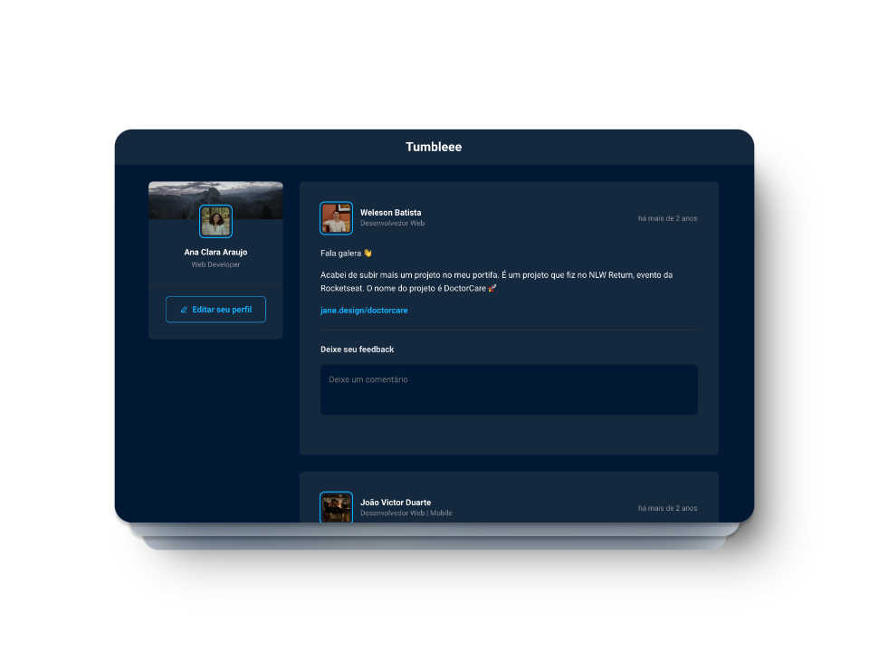

# Tumbleee

**Tumbleee** é uma rede social inspirada no Tumblr, desenvolvida em **React** com **TypeScript**. A plataforma permite que os usuários compartilhem seus pensamentos e conteúdos em um feed dinâmico. Os principais recursos incluem:

- **Comentários:** Os usuários podem comentar nos posts de outros usuários, promovendo discussões e interações.
- **Aplausos:** Os usuários têm a opção de aplaudir comentários que apreciam, destacando interações positivas na comunidade.
- **Gerenciamento de Comentários:** Cada usuário pode deletar seus próprios comentários, garantindo controle sobre seu conteúdo.

Com uma interface intuitiva e interativa, o Tumbleee visa proporcionar uma experiência envolvente e amigável para todos os usuários, facilitando a expressão pessoal e a conexão entre amigos e comunidades.

## Tecnologias

  
  
  
  
    

## Licença

Este projeto está licenciado sob a [MIT License](LICENSE).